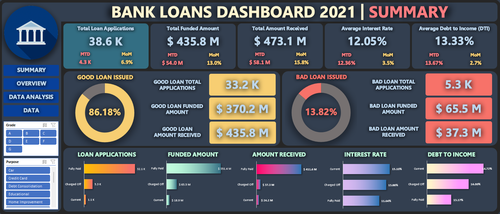

# Bank Loans Dashboard 2021

Welcome to the Bank Loans Data Analysis Project! This project focuses on analyzing bank loans data from the year 2021 using Microsoft Excel.

## Project Objective

The bank wants to create a 2021 loans dashboard to understand the performance of its loans and develop strategies to optimize its offerings and increase customer satisfaction in the years to come.

## Project Overview

### Data

You can see the dataset here [Bank Loans Dataset](./dataset.csv)

### Project

You can see the final project here [Project](./dashboard.xlsx)

### Conclusions

- There are 4K loan applications
- The total funded amount is $54M
- The total amount received is $58M
- The average interest rate is 12%
- The average debt-to-income ratio is 14%
- There are more good loans (86%)
- Fully Paid is the most common loan status
- December is the month with the highest number of loans issued
- California is the state with the highest number of loans issued
- 36 months is the most common loan term (73%)
- Employees with 10 years of service issued the most loans (9K)
- Debt consolidation is the most common loan purpose (18K)
- Rent is the most common home ownership status (18K)
